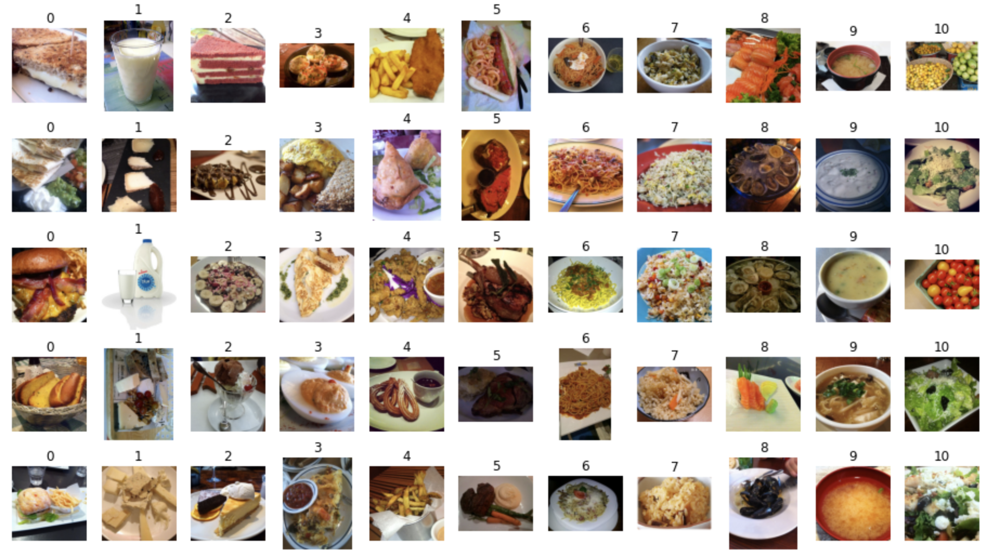

# Dataset
Food classification [dataset](https://reurl.cc/3DLavL), class includes: (0)Bread, (1)Dairy product, (2)Dessert, (3)Egg, (4)Fried food, (5)Meat, (6)Noodles/Pasta, (7)Rice, (8)Seafood, (9)Soup, and (10)Vegetable/Fruit.

Every images size are different, so we should resize before training/prediction.

# Package
using [timm](https://pypi.org/project/timm/) package to load efficientNet backbone

# Kaggle
[kaggle](https://reurl.cc/ZO7XpM)
